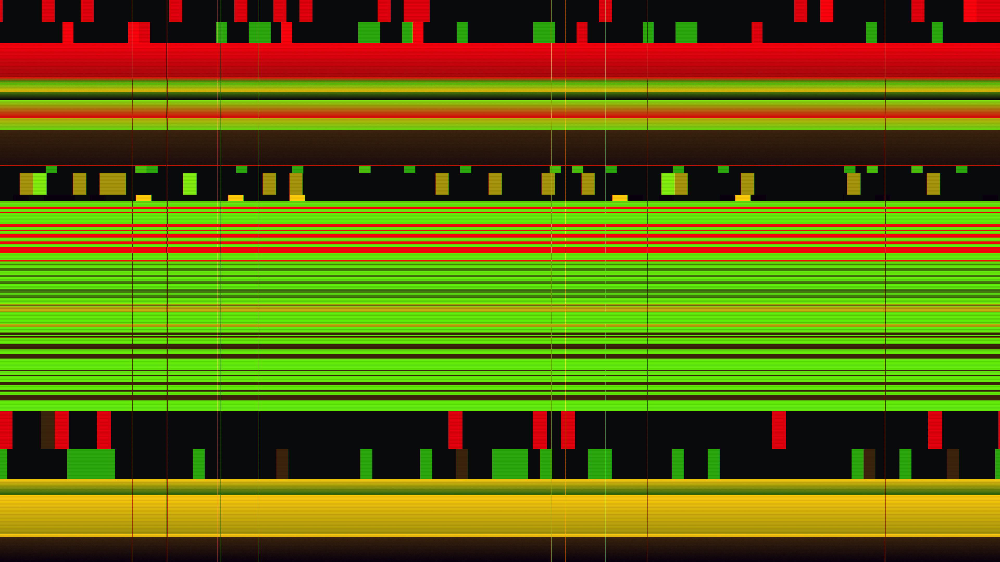

# glitch_strata_v3

## Metadata
- **Date**: 2026-05-17
- **Theme**: luxury decay, obsidian & gold, digital archaeology, high-fidelity corruption, beautiful night sky.
- **Technique**: Vectorized 2D pixel-buffer manipulation (NumPy). Implements recursive stratification with dynamic time-varying boundaries, horizontal wave tearing, digital block sliding, chromatic aberration (RGB channel splitting), and retro analogue scanlines.
- **Logic Lab Reference**: None

## Concept
A majestic, high-fidelity refinement of the `glitch_strata` concept, transforming it into a dynamic 10-second 4K/60fps animation. A vertical cross-section of luxury data-memory is rendered as an elegant, shimmering tapestry of obsidian, deep gold, and pale amber, heavily infused with rich amethysts, magentas, and cobalt highlights. Intricate horizontal displacement mapping, tracking glitches, and RGB channel splitting reveal the hidden beauty of corrupted information against a silent, star-dusted night.

## Changes from Previous Version
- **Transition to True Animation**: Shifted from a static sketch to a 10-second 60fps video loop using dynamic, vectorized time-varying equations.
- **Expanded Palette**: Introduced deep, luxurious Royal Amethyst, Cyber Magenta, and Cobalt Blue alongside the core Obsidian & Gold, directly addressing the "more color" request.
- **Vectorized RGB Channel Splitting**: Implemented high-performance, axis-aligned channel shifts (`np.roll`) simulating chromatic aberration under high-energy signal tearing.
- **Tracking Errors & Voltage Flicker**: Added dynamic horizontal slice tears and temporary dark-frame flickers to represent raw digital decay.
- **Retina-Safe NumPy Scaling**: Fully calibrated to dynamically map screen-coordinates to the pixel buffer's physical resolution.

## Technical Details
- **Renderer**: P2D
- **Simulation**: NumPy, recursive.
- **Visuals**: pixel-buffer rendering, dark-field contrast.
- **Animation**: Animation (10s @ 60fps)
