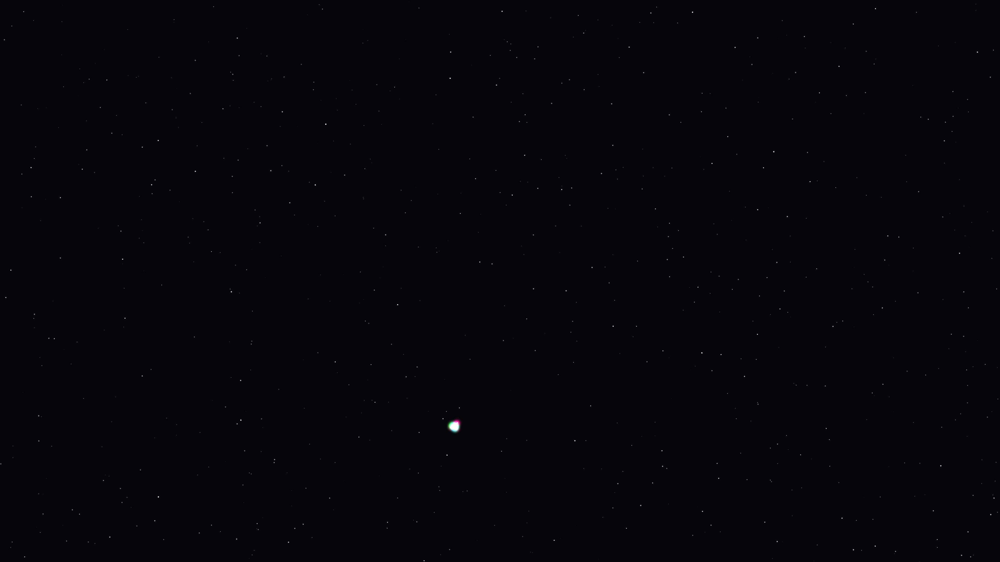

# gluon_flux

## Metadata
- **Date**: 2026-05-05
- **Theme**: Subatomic physics, particle confinement, energetic tension, beautiful night sky
- **Technique**: Force-directed lattice with confinement spring logic ($F \propto r$), additive spectral bloom, high-density starfield rendering, animated tension-weighted edge modulation

## Concept
A dense, vibrating web of "quarks" held together by shimmering "gluon flux tubes" in electric magenta, lime, and cobalt; as the particles drift apart, the tension-weighted connections flare with white-gold energy, creating a complex, high-energy lattice against a deep star-dusted night sky.

## Technical Details
- **Renderer**: P2D
- **Simulation**: Force-directed lattice with confinement spring logic ($F \propto r$)
- **Visuals**: additive spectral bloom, high-density starfield rendering, animated tension-weighted edge modulation
- **Animation**: 10s @ 60fps (typical)
