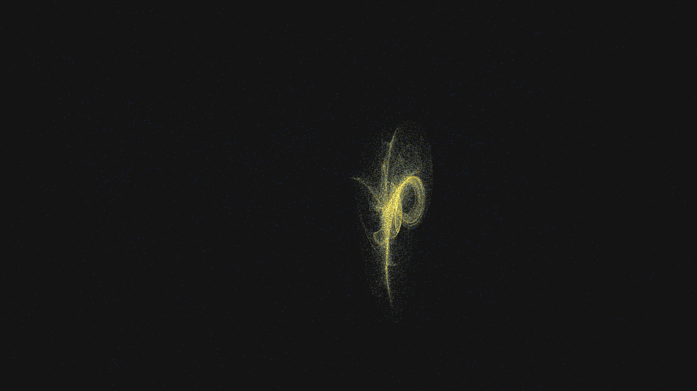

# gravitational_caustic_refraction

## Metadata
- **Date**: 2026-05-09
- **Theme**: Gravitational lensing, light caustics, General Relativity, beautiful night sky.
- **Technique**: 3D ray-tracing of 150,000 light rays deflected by four moving gravitational centers (lenses). Deflection is calculated using a vectorized non-linear force field, resulting in complex caustic folds and sharp light convergences. Multi-pass additive point rendering with a "Nebula Gold / Electric Azure / Diamond White" HSB palette and a subtle high-density starfield. 60fps high-bitrate MP4.
- **Logic Lab Reference**: None

## Concept
A majestic visualization of space-time warping; silken ribbons of shimmering gold and electric azure light dance and fold into intricate caustic patterns as they are bent by invisible gravitational giants against the star-dusted obsidian night.

## Technical Details
- **Renderer**: P3D
- **Simulation**: 3D ray-tracing of 150,000 light rays deflected by four moving gravitational centers (lenses).
- **Visuals**: additive blending, HSB spectral mapping.
- **Animation**: 20 seconds at 60fps
