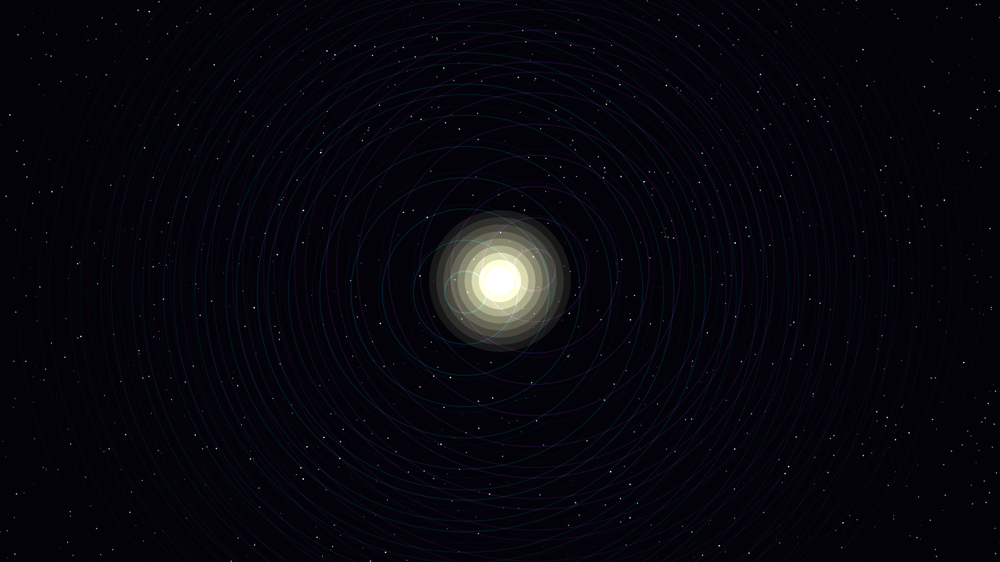

# gravitational_echoes

## Metadata
- **Date**: 2026-05-05
- **Theme**: Gravitational waves, binary merger, spacetime distortion, beautiful night sky.
- **Technique**: Phase-space wave superposition, chirping orbital emitters, subpixel starfield distortion (lensing simulation), additive interference rendering.
- **Logic Lab Reference**: None

## Concept
A rhythmic, shimmering visualization of a binary merger where expanding wave-fronts of electric cyan and royal amethyst interfere to create complex spectral fringes; the background starfield is dynamically warped by the passing gravitational waves, culminating in a bright white-gold flash at the center of the obsidian void.

## Technical Details
- **Renderer**: P2D
- **Simulation**: Phase-space wave superposition, chirping orbital emitters, subpixel starfield distortion (lensing simulation), additive interference renderi.
- **Visuals**: additive blending, HSB spectral mapping, prismatic color, dark-field contrast.
- **Animation**: 10 seconds at 60fps
