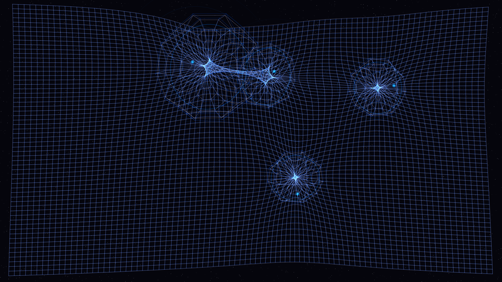

# gravitational_warp

## Metadata
- **Date**: 2026-05-05
- **Theme**: Space-time curvature, gravitational lensing, cosmic void, beautiful night sky.
- **Technique**: Multi-pass conformal coordinate warping (inverse-square lensing approximation), dual-pass additive sapphire/silver grid rendering, distorted Einstein rings, chromatic aberration (spatial color split), high-density multi-magnitude starfield.
- **Logic Lab Reference**: None

## Concept
A stunning visualization of space-time distortion where the underlying geometric fabric of the universe is warped by four massive, invisible singularities; shimmering silver grid lines bend and arc around luminous sapphire focal points, creating complex "Einstein rings" and delicate spectral fringes that pulse with an ethereal intensity against a deep, star-dusted midnight navy void.

## Technical Details
- **Renderer**: P2D
- **Simulation**: Multi-pass conformal coordinate warping (inverse-square lensing approximation), dual-pass additive sapphire/silver grid rendering, distorted.
- **Visuals**: additive blending, prismatic color.
- **Animation**: Still image
