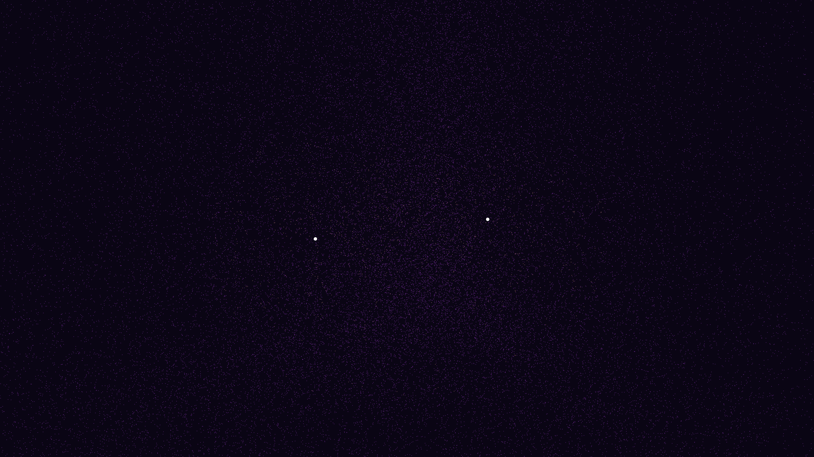

# gravitational_wave_chirp

## Metadata
- **Date**: 2026-05-12
- **Theme**: General relativity, binary black hole merger, gravitational waves, space-time ripples.
- **Technique**: 3D particle simulation (80,000 particles) distorted by a metric perturbation field. Chirp frequency/amplitude scaling and ringdown logic. Multi-pass additive rendering. 15s 4K/60fps MP4 (1080p source).
- **Logic Lab Reference**: None

## Concept
Two binary black holes spiral and merge, triggering a titanic chirp of space-time ripples that radiate as concentric waves of Deep Violet and Electric Gold.

## Technical Details
- **Renderer**: P3D
- **Simulation**: particle, 3D particle.
- **Visuals**: additive blending, HSB spectral mapping, bloom-like highlights, prismatic color, dark-field contrast.
- **Animation**: 15 seconds at 60fps
