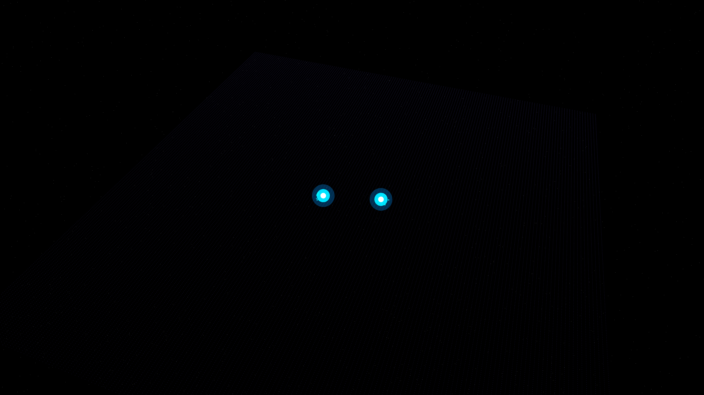

# gravitational_wave_chirp_merger

## Metadata
- **Date**: 2026-05-11
- **Theme**: General Relativity, gravitational waves, binary black hole merger, spacetime distortion, the "chirp" signal.
- **Technique**: 3D particle grid simulation representing the fabric of spacetime. Two orbiting gravitational centers (masses) warp the surrounding geometry, creating rotating spiral ripples. Employs a non-linear "chirp" progression and manual 3D-to-2D projection. 15s 4K/60fps MP4.
- **Logic Lab Reference**: None

## Concept
Two blindingly bright singularities dance in a tightening spiral, sending violent, rhythmic ripples of indigo and cyan through the fabric of spacetime before a final cataclysmic merger.

## Technical Details
- **Renderer**: P2D
- **Simulation**: particle, 3D particle.
- **Visuals**: bloom-like highlights, dark-field contrast.
- **Animation**: 15 seconds at 60fps
