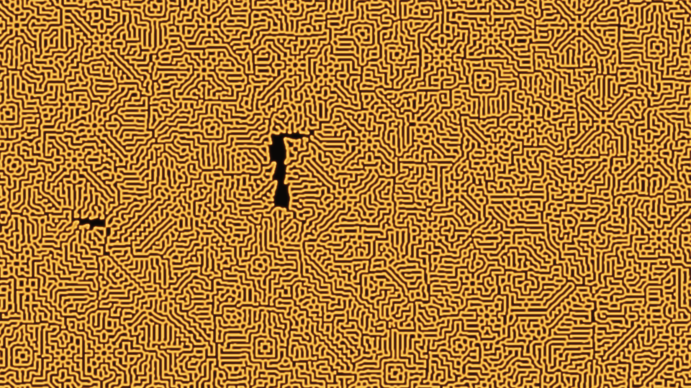

# gray_scott_reaction_diffusion_morphogenesis

## Metadata
- **Date**: 2026-06-08
- **Theme**: The Gray-Scott model is a system of two coupled PDEs (feed chemical U, autocatalytic chemical V) tha
- **Technique**: - **Simulation**: Gray-Scott PDE discretized on a 960×540 grid, 20 integration steps per rendered frame - **Laplacian**: 5-point stencil convolution (via `scipy.ndimage.convolve`) with periodic boundary - **Parameters**: F=0.055, K=0.062 (coral/maze regime from Pearson 1993) - **Rendering**: U concentration contrast-stretched to [0.25, 1.0] → mapped to warm earth-tone palette, nearest-neighbor upscaled to 4K
- **Logic Lab Reference**: 

## Concept
The Gray-Scott model is a system of two coupled PDEs (feed chemical U, autocatalytic chemical V) that exhibits Turing instability — a mathematical explanation for how biological organisms self-organize their skin patterns without any global blueprint. Starting from a near-uniform field with tiny random perturbations, discrete crystalline nucleation sites form and then merge into the labyrinthine coral pattern. The small dark topological defects visible in the final state are authentic features of real reaction-diffusion systems.

## Technical Details
- **Renderer**: Unknown
- **Simulation**: Unknown
- **Visuals**: Unknown
- **Animation**: Contains animation details
