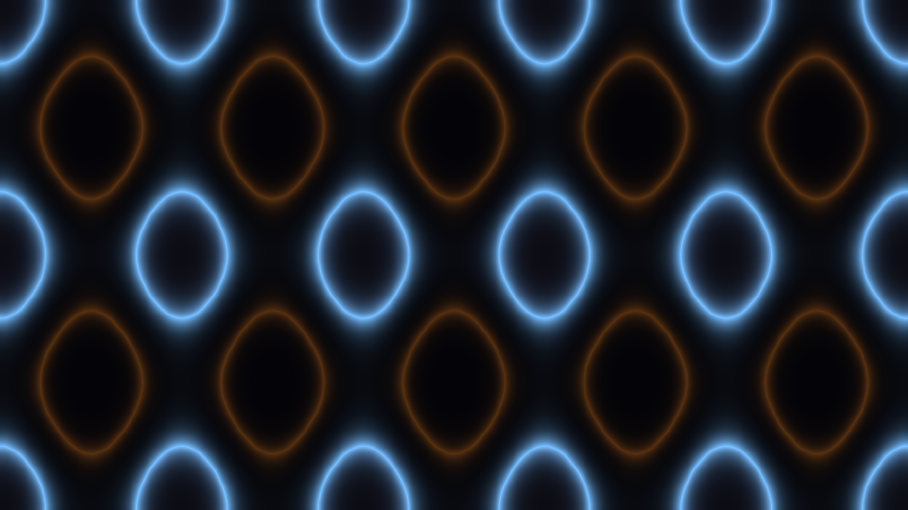

# gyroid_minimal_surface_flow_2d

## Metadata
- **Date**: 2026-06-08
- **Theme**: Cross-sectional slices of four triply periodic minimal surfaces (TPMS) — Gyroid, Schwarz D, Schwarz 
- **Technique**: - 960×540 numpy grid evaluating TPMS scalar fields per frame, 4× upscaled to 4K - TPMS formulas evaluated via vectorized numpy sin/cos - Smooth blend interpolation between consecutive surface types (Gyroid → Schwarz D → Schwarz P → Neovius) over 20 seconds - Z-phase sweeps 0 → 2π simultaneously, causing the cross-section pattern to morph - Glowing isosurface rendering: Gaussian falloff centered at f = 0 (primary) and f = ±1.8 (secondary contours) - Slowly shifting hue cycle for the glow colors
- **Logic Lab Reference**: 

## Concept
Cross-sectional slices of four triply periodic minimal surfaces (TPMS) — Gyroid, Schwarz D, Schwarz P, and Neovius — animated as the slicing plane sweeps continuously through Z while the surfaces blend into one another. Each TPMS partitions 3D space into two interpenetrating labyrinths; the 2D cross-sections reveal shifting lattices of closed curves that dissolve and reconnect in hypnotic waves.

## Technical Details
- **Renderer**: Unknown
- **Simulation**: Unknown
- **Visuals**: Unknown
- **Animation**: Unknown
