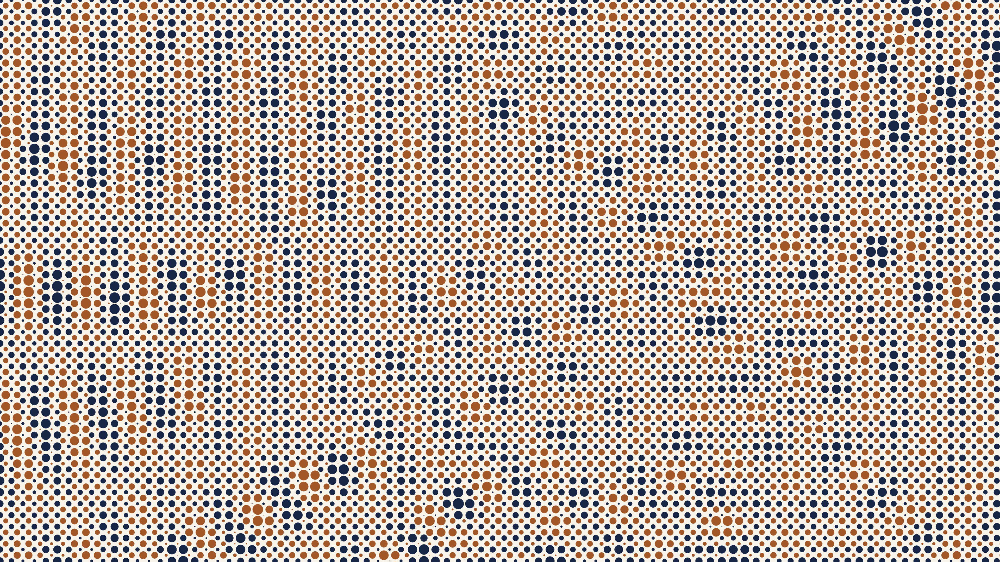

# halftone_waves

## Metadata
- **Date**: 2026-04-26
- **Theme**: printing, halftone, wave interference, graphic design.
- **Technique**: two interleaved dot grids (offset by half cell), cosine wave superposition amplitude drives dot radius, power-stretch contrast, complementary two-color fields.
- **Logic Lab Reference**: None

## Concept
Four wave point sources create interference; amplitude drives navy dot radius on a regular grid and complementary (inverted) amplitude drives sienna dots on a half-cell-offset grid; constructive and destructive peaks appear as clusters of large navy or sienna dots with bare cream paper at interference nulls.

## Technical Details
- **Renderer**: P2D
- **Simulation**: two interleaved dot grids (offset by half cell), cosine wave superposition amplitude drives dot radius, power-stretch contrast, complementar.
- **Visuals**: bloom-like highlights, dark-field contrast.
- **Animation**: Still image
