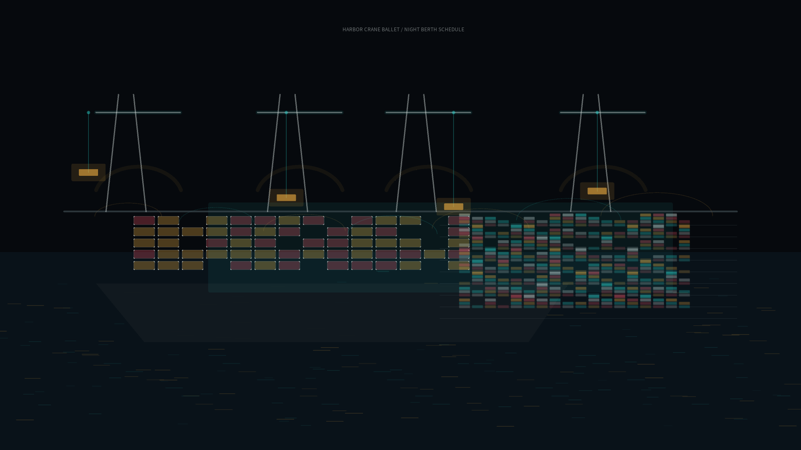

# harbor_crane_ballet

## Metadata
- **Date**: 2026-05-19
- **Theme**: A night container terminal where gantry cranes move with the calm precision of choreography.
- **Technique**: Procedural port scene with container stacks, ship berths, gantry crane kinematics, trolley/load motion, berth lights, and water reflections.
- **Logic Lab Reference**: None

## Concept
`harbor_crane_ballet` turns container handling into a wide nocturnal choreography. Cranes glide along rails, trolleys lower containers between ship and yard, and the harbor water converts industrial signal lights into wavering reflections.

## Technical Details
- **Renderer**: P2D
- **Simulation**: Multi-crane parametric motion with independent rail travel, trolley oscillation, hoist height, and procedural container stacks
- **Visuals**: Dark harbor water, steel gantries, cyan/amber/red container signals, silver rails, reflected berth lights
- **Animation**: 10 seconds at 60fps, generating `output.mp4` and `harbor_crane_ballet_p1.png`
