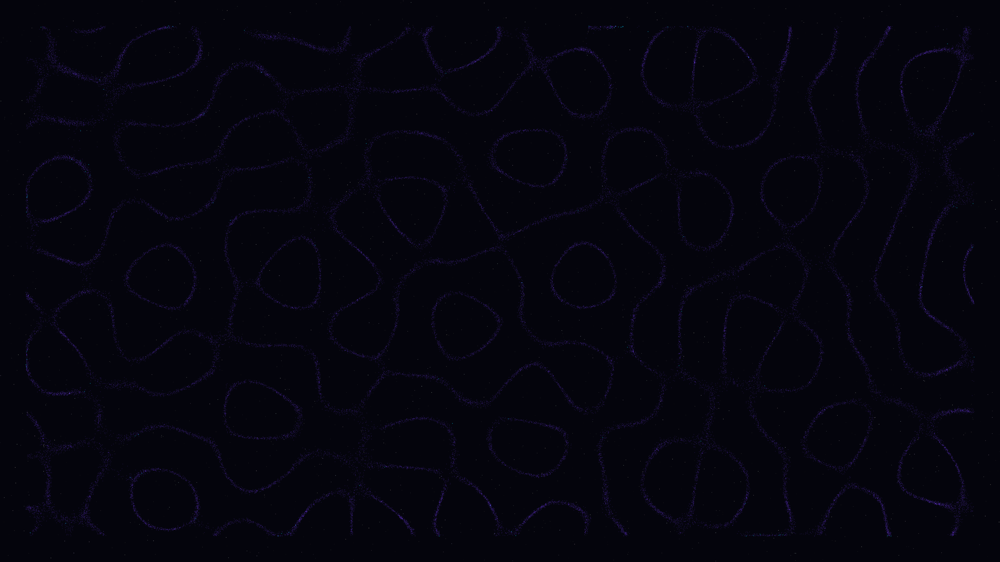

# harmonic_levitation

## Metadata
- **Date**: 2026-05-05
- **Theme**: Resonant assembly, acoustic trapping, celestial geometry, beautiful night sky.
- **Technique**: Dynamic multi-source wave interference field (8 oscillators), gradient-based particle advection (60,000 particles), HSB-spectral energy mapping, dense starfield with twinkle effect, 60fps high-quality MP4 encoding.
- **Logic Lab Reference**: None

## Concept
An intricate visualization of matter responding to invisible resonant frequencies; 60,000 particles of light navigate a dynamic wave field, assembling into shimmering geometric nodes that morph and pulse as the frequencies shift, creating a delicate, celestial dance against a deep star-dusted void.

## Technical Details
- **Renderer**: P2D
- **Simulation**: particle.
- **Visuals**: HSB spectral mapping, prismatic color, dark-field contrast.
- **Animation**: 10 seconds at 60fps
