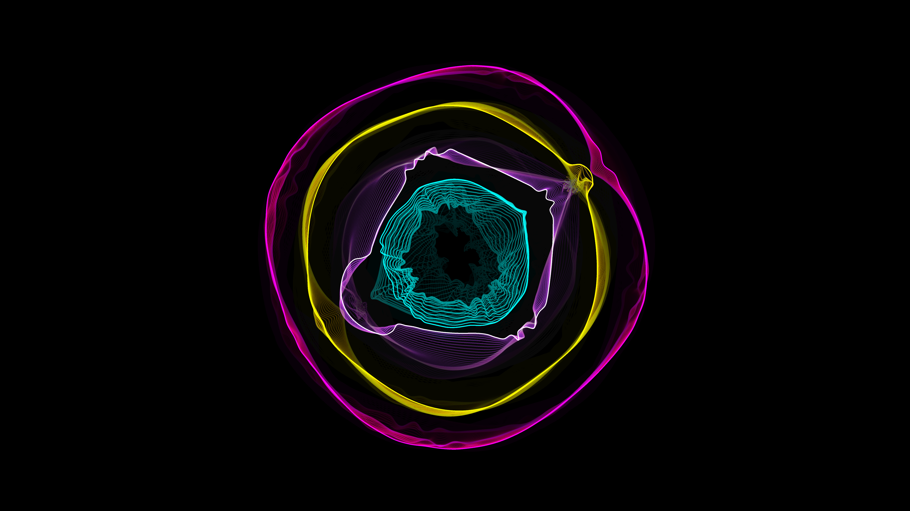

# harmonic_vibrance

## Metadata
- **Date**: 2026-05-04
- **Theme**: Harmonic resonance, celestial mechanics, elastic geometry, beautiful night sky
- **Technique**: Concentric Verlet-integrated elastic rings, multi-emitter harmonic wave interference, PGraphics persistent trail accumulation, additive spectral bloom
- **Logic Lab Reference**: `physics/spring_mesh/spring_mesh.py`, `physics/additive_wave/additive_wave.py`

## Concept
A series of shimmering, elastic geometric rings vibrate and pulse in response to complex harmonic wave interference; the concentric layers of electric cyan, amethyst, and amber leave persistent spectral trails as they resonate against a vast, star-dusted obsidian void.

## Technical Details
- **Renderer**: P2D
- **Simulation**: Concentric Verlet-integrated elastic rings
- **Visuals**: multi-emitter harmonic wave interference, PGraphics persistent trail accumulation, additive spectral bloom
- **Animation**: 10s @ 60fps (typical)
