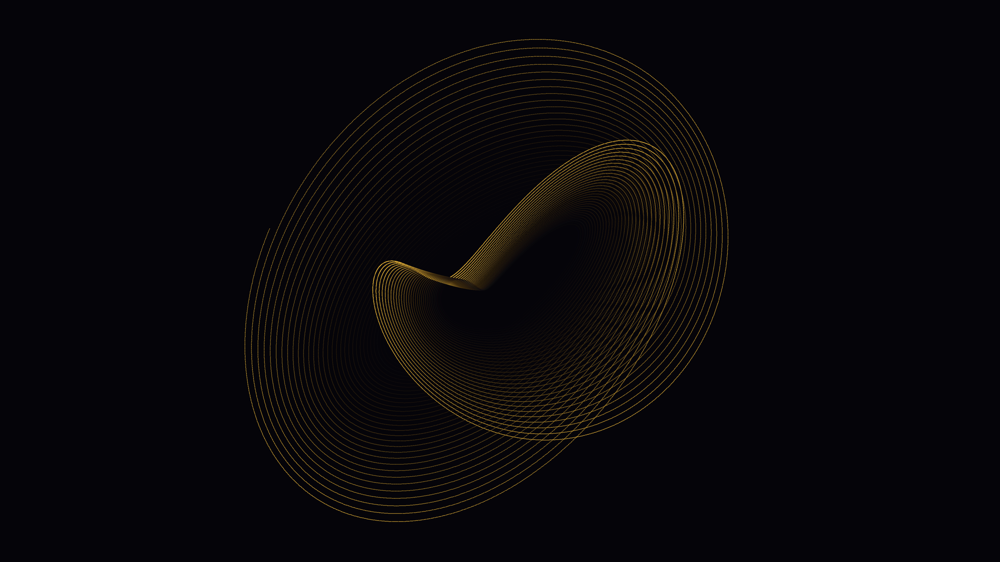

# harmonograph

## Metadata
- **Date**: 2026-04-26
- **Theme**: physics, oscillation, mechanical drawing, decay.
- **Technique**: dual-pendulum harmonograph (4-component parametric x/y), exponential decay, near-rational 2:3 frequency ratios, age-based gold→amber color gradient.
- **Logic Lab Reference**: None

## Concept
A single 500k-point trace follows the full life of a dual-pendulum plotter from wide gold swings to dim amber spirals converging at center; twisted-ribbon forms emerge from the interplay of two slightly incommensurate oscillating pendulums.

## Technical Details
- **Renderer**: P2D
- **Simulation**: dual-pendulum harmonograph (4-component parametric x/y), exponential decay, near-rational 2:3 frequency ratios, age-based gold→amber color g.
- **Visuals**: bloom-like highlights, dark-field contrast.
- **Animation**: Still image
