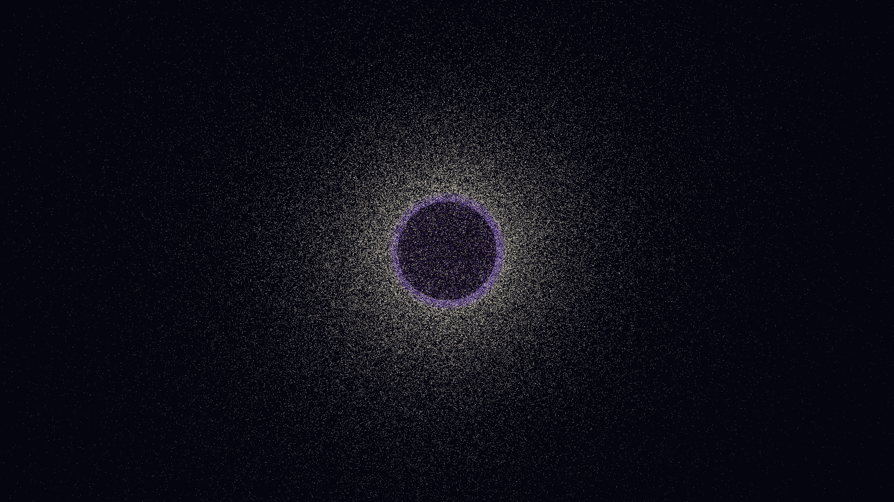

# hawking_radiation_singularity

A 3D simulation of a black hole's evaporation via virtual particle pair production at the event horizon.

## Description

A majestic and somber vision of a black hole slowly bleeding light into the void; a perfect circle of darkness is surrounded by a boiling, iridescent shell of quantum energy, with silken threads of white-gold light escaping like cosmic steam into a deep, star-dusted night.

## Technique

- **Physics**: 3D simulation of a central gravitational singularity using a Schwarzschild metric approximation.
- **Quantum Horizon**: Continuous generation of virtual particle pairs near the event horizon ($r=2M$).
- **Dynamics**: One member of each pair (Electric Indigo) is consumed by the hole via inward radial acceleration, while the other (White-Gold) escapes as Hawking radiation via outward spiral trajectories.
- **Rendering**: Multi-pass additive rendering featuring a dark central shadow, a pulsing "stretched horizon" glow, and a high-density background starfield (10,000 stars).
- **Format**: 10-second animation @ 60fps, 4K resolution.

## Preview

