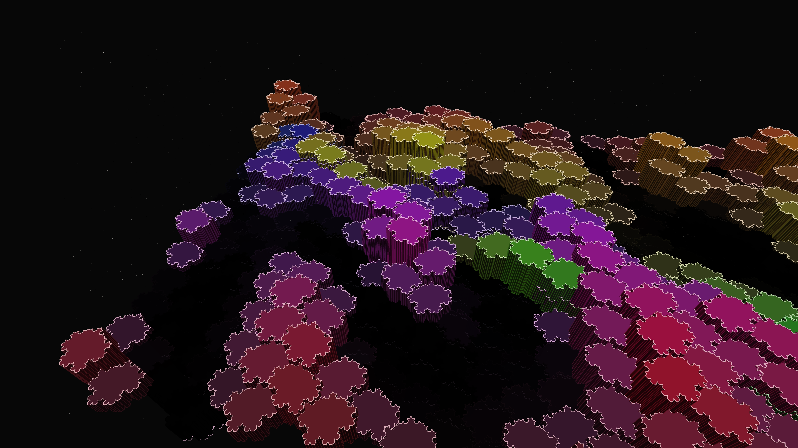

# hexagonal_fractalopolis

## Metadata
- **Date**: 2026-05-04
- **Theme**: Non-Euclidean urbanism, fractal infrastructure, modern architectural twist, beautiful night sky
- **Technique**: IH02 Isohedral tiling (TV08 model), recursive Koch curve subdivision, 3D monolithic height modulation (P3D), atmospheric bloom rendering
- **Logic Lab Reference**: `tiling_patterns/ih02_tv08_koch/ih02_tv08_koch.py`

## Concept
A dense, shimmering landscape of fractal buildings that sprawl across a non-Euclidean hexagonal grid; every structure is defined by recursive Koch edges, creating a "gear-like" architectural complexity that pulses with neon highlights against a deep star-dusted night sky.

## Technical Details
- **Renderer**: P3D
- **Simulation**: IH02 Isohedral tiling (TV08 model)
- **Visuals**: recursive Koch curve subdivision, 3D monolithic height modulation (P3D), atmospheric bloom rendering
