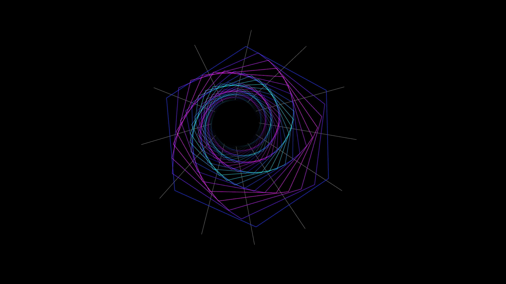

# holographic_data_stream_tunnel_3d

## Metadata
- **Date**: 2026-05-29
- **Theme**: - **Date**: 2026-05-29 - **Theme**: A high-speed flight through a hexagonal tunnel made of cascading
- **Technique**: Unknown
- **Logic Lab Reference**: 

## Concept
- **Date**: 2026-05-29
- **Theme**: A high-speed flight through a hexagonal tunnel made of cascading, glowing holographic data streams and geometric wireframes.
- **Technique**: A 3D tunnel drawn using concentric hexagonal wireframe rings that scale up and move towards the camera, with flowing py5.lines connecting them.
- **Description**: An animated continuous, dizzying rush forward through an endless glowing cyan and magenta hexagonal tunnel.

## Technical Details
- **Renderer**: Unknown
- **Simulation**: Unknown
- **Visuals**: Unknown
- **Animation**: Unknown
