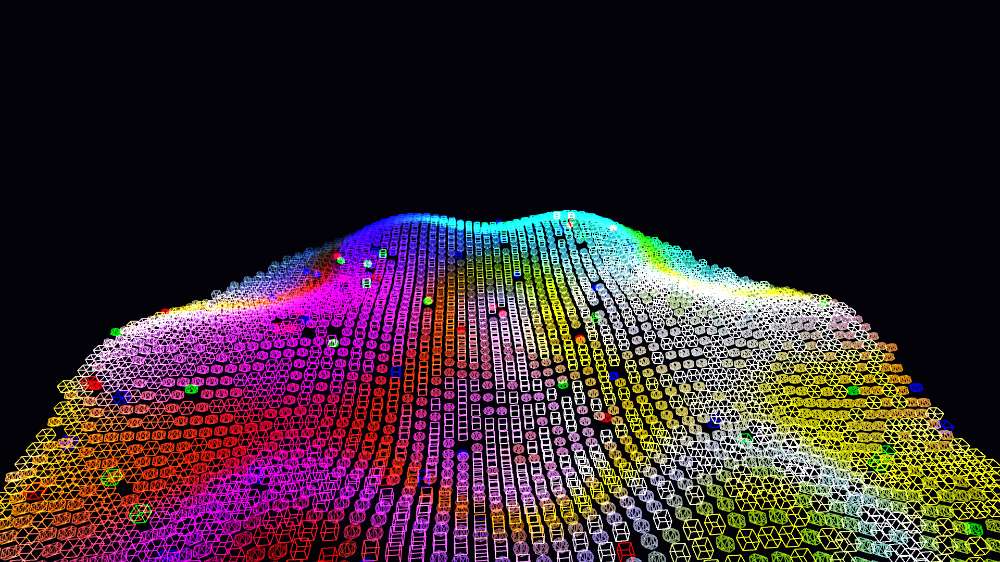

# holographic_lattice_collapse

## Metadata
- **Date**: 2026-05-23
- **Theme**: A 3D isometric or pseudo-3D hexagonal lattice that shimmers holographically in neon colors, and then collapses due to randomized scaling and displacement glitches over time.
- **Technique**: Procedural P3D grid of polygons, additive blending, sine wave based height maps mapped to color, and random glitch displacements applied to vertices and global pixels based on noise. Datamosh tearing via NumPy array manipulation. 15s 60fps MP4.
- **Logic Lab Reference**: None

## Concept
A visualization of an idealized, shimmering geometric manifold suffering from catastrophic data collapse. The piece juxtaposes the rigid, mathematical beauty of an undulating 3D lattice with the aggressive, unpredictable nature of digital corruption.

## Technical Details
- **Renderer**: P3D
- **Simulation**: Additive blending of a 3D procedural grid structure deformed by overlapping sinusoidal waves
- **Visuals**: Dynamic P3D vertex manipulation combined with real-time NumPy buffer datamoshing (horizontal tearing, saturation spikes)
- **Animation**: 15 seconds at 60fps
