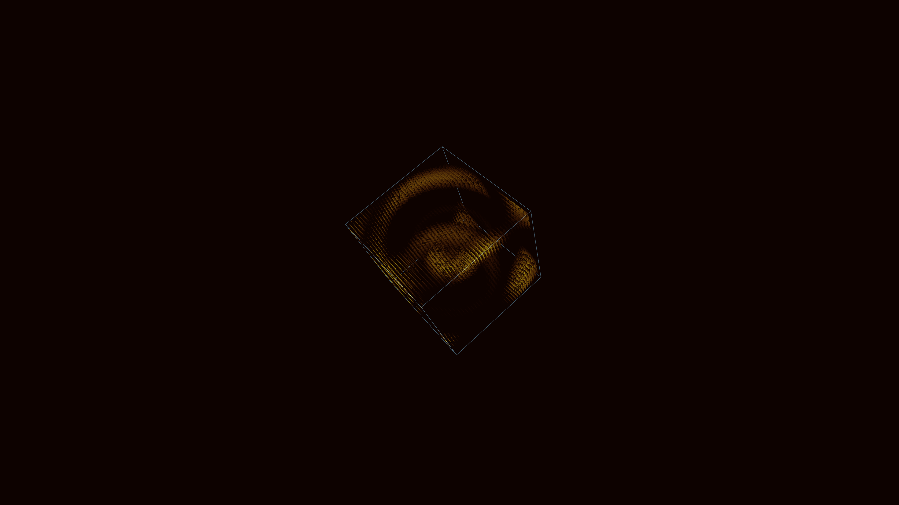

# holographic_quantum_interference_cube_3d

## Details
- **Date**: 2026-06-07
- **Theme**: A massive, rotating 3D cube made of thousands of translucent, glowing data-planes. Inside the cube, complex 3D sine waves create interference patterns that flow through the planes.
- **Technique**: Volumetric rendering using stacked 2D planes with additive blending. The planes map a 3D interference function (sine waves) to color and opacity.
- **Palette**: Obsidian background, electric blue, intense cyan, and bright white.

## Media

