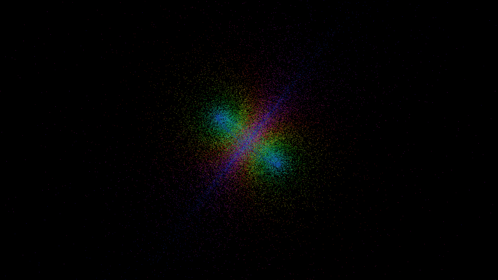

# hopf_fibration_flow

## Metadata
- **Date**: 2026-05-23
- **Theme**: A continuous flow of particles mapped from the 3-sphere to the 2-sphere using the Hopf fibration, pr
- **Technique**: Unknown
- **Logic Lab Reference**: 

## Concept
A continuous flow of particles mapped from the 3-sphere to the 2-sphere using the Hopf fibration, projected stereographically into 3D space.

- **Theme**: The mathematical beauty of the Hopf fibration, showing linked circles flowing seamlessly through each other in 3D space.
- **Technique**: 3D point cloud of 50,000 particles parameterized by angles on S2 and a fiber angle. The points flow along the fiber angle and are stereographically projected into R3. Additive blending with spectral colors mapped to the base angle. 15s 60fps MP4.
- **Description**: Thousands of glowing particles weave together into an intricate set of interlinked tori. As the system flows, the particles trace the continuous, non-intersecting rings of the Hopf fibration, projecting higher-dimensional geometry into a mesmerizing dance of light.

## Technical Details
- **Renderer**: Unknown
- **Simulation**: Unknown
- **Visuals**: Unknown
- **Animation**: Contains animation details
