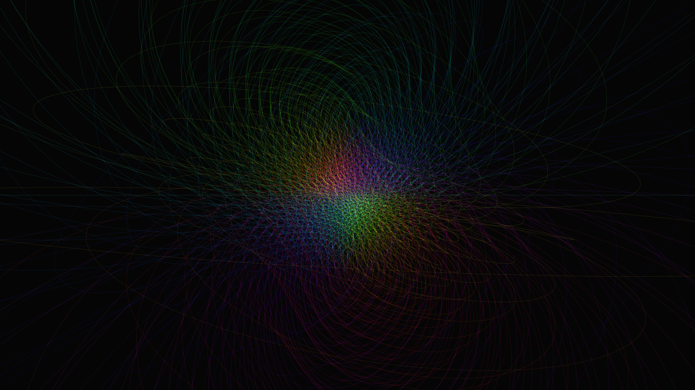

# hopf_fibration_projection

## Metadata
- **Date**: 2026-05-22
- **Theme**: The mathematical elegance of the Hopf Fibration, projecting the 4D hypersphere onto 3D space as a se
- **Technique**: Unknown
- **Logic Lab Reference**: 

## Concept
The mathematical elegance of the Hopf Fibration, projecting the 4D hypersphere onto 3D space as a seamless arrangement of interlocking, luminous circular fibers that rotate endlessly in higher dimensions.

## Technical Details
- **Renderer**: Unknown
- **Simulation**: Unknown
- **Visuals**: Unknown
- **Animation**: Contains animation details
