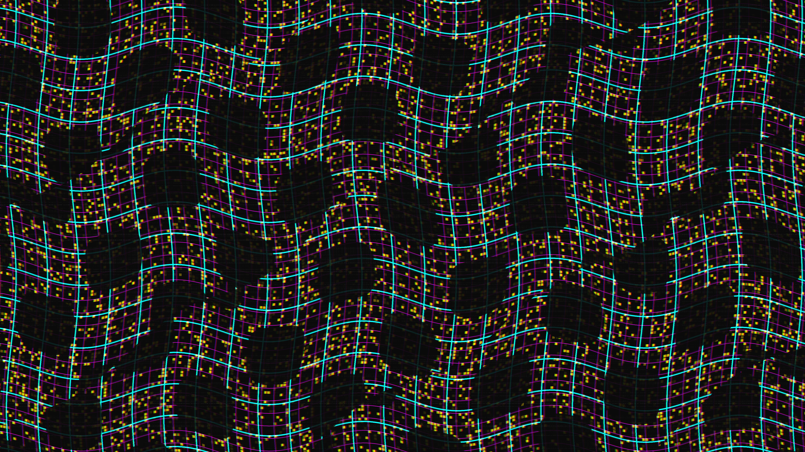

# hyper_chromatic_glitch_fold

## Metadata
- **Date**: 2026-05-22
- **Theme**: A high-density data matrix folding and tearing itself apart, bleeding brilliant spectral colors as i
- **Technique**: Unknown
- **Logic Lab Reference**: 

## Concept
A high-density data matrix folding and tearing itself apart, bleeding brilliant spectral colors as its structural integrity collapses under recursive glitches.

## Technical Details
- **Renderer**: Unknown
- **Simulation**: Unknown
- **Visuals**: Unknown
- **Animation**: Contains animation details
