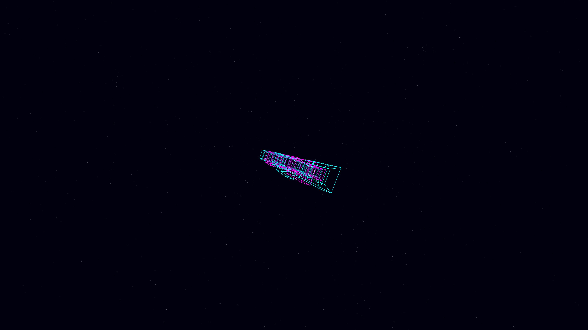

# hyper_dimensional_tesseract_lattice

- **Date**: 2026-05-06
- **Theme**: 4D geometry, tesseract lattice, high-tech urbanism, beautiful night sky
- **Technique**: 3D projection of a rotating 4D tesseract lattice (a $3 \times 3 \times 3$ grid of hypercubes). Features continuous 4D rotations in multiple planes ($XW$, $YW$, $ZW$), causing the projected 3D geometry to morph and "unfold" surrealistically. Multi-pass additive rendering with a Cyan/Magenta palette, $W$-coordinate-based alpha modulation for hyperspace depth, and a high-density background starfield. 60fps high-bitrate MP4.
- **Description**: A mesmerizing, high-tech vision of higher-dimensional architecture; a vast, glowing grid of light morphs and unfolds into itself, representing the hidden data-structures that underpin a digital, iridescent cosmos against the deep obsidian night.

