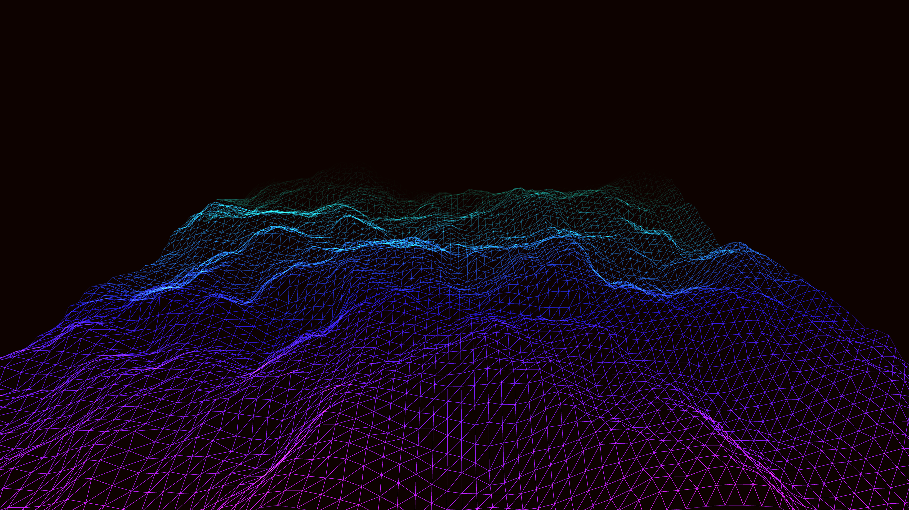

# hyper_speed_neon_terrain_wireframe_3d

## Details
- **Date**: 2026-06-07
- **Theme**: A hyper-speed journey through a digital wireframe terrain that morphs like sand dunes in the wind.
- **Technique**: Procedurally generated 3D terrain grid using 2D Perlin noise that shifts over time. The camera moves forward simulating a journey. Additive blending with wireframe lines.
- **Palette**: Obsidian background, electric orange, fiery red, and hot magenta.

## Media

