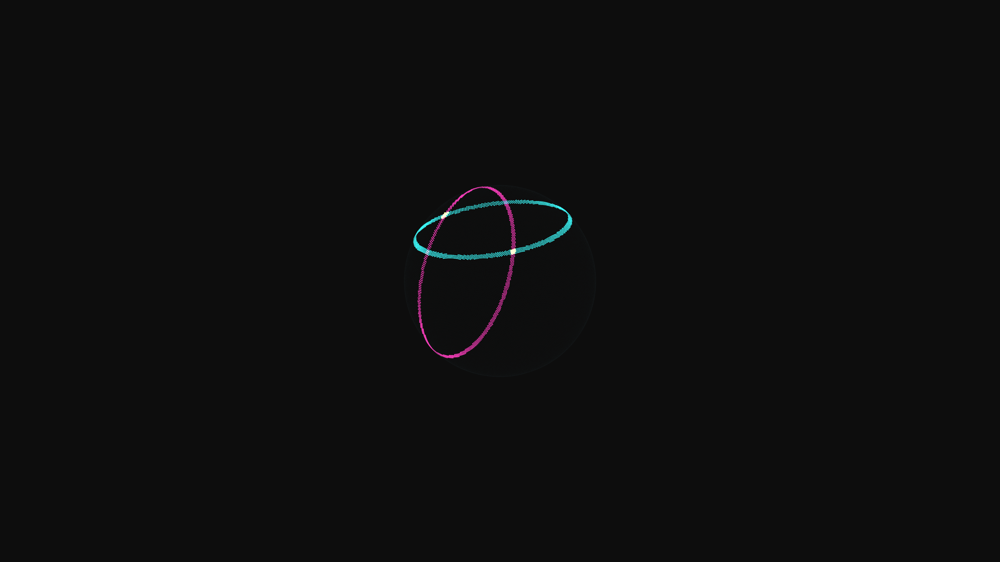

# hyper_sphere_geometric_cross_sections_3d

## Metadata
- **Date**: 2026-06-13
- **Theme**: A massive, glowing 3D hyper-sphere that is continuously sliced by invisible, rotating planes, reveal
- **Technique**: A dense 3D Fibonacci sphere point cloud. Points are drawn dynamically when they fall within a threshold distance of rotating mathematical planes `Ax + By + Cz + D = 0`. Uses vectorized Numpy operations to mask and render cross-sections efficiently with additive blending.
- **Logic Lab Reference**: 

## Concept
A massive, glowing 3D hyper-sphere that is continuously sliced by invisible, rotating planes, revealing intricate internal geometries and glowing cross-sections.

## Technical Details
- **Renderer**: Unknown
- **Simulation**: Unknown
- **Visuals**: Unknown
- **Animation**: Animation (20s @ 60fps)
