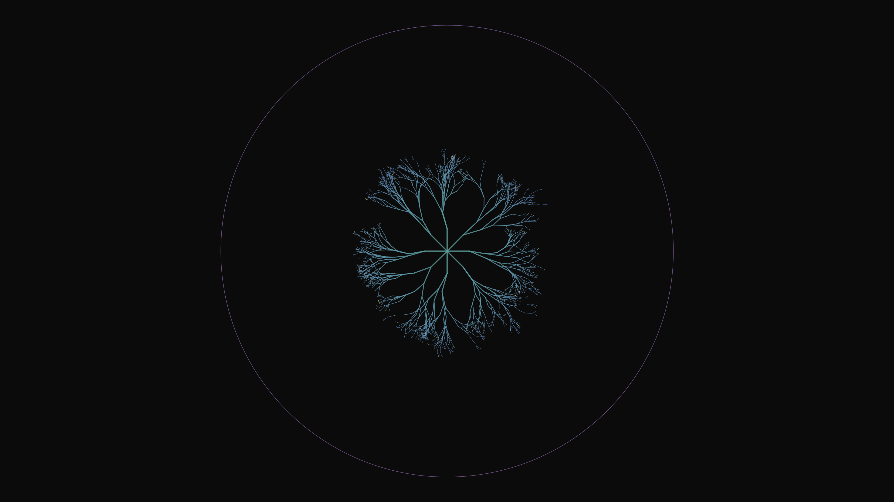

# hyperbolic_growth

## Metadata
- **Date**: 2026-05-04
- **Theme**: Non-Euclidean growth, constrained infinity, coral morphology, mathematical lens
- **Technique**: Recursive hyperbolic branching (Poincaré disk model), Mobius coordinate transformation, depth-weighted stochastic jitter, HSB-spectral gradient rendering
- **Logic Lab Reference**: `fractals/stochastic_tree/stochastic_tree.py` — used for recursive branching and stochastic jitter logic

## Concept
A circular Poincaré disk contains an intricate web of seafoam and amethyst branches that sprout from the center and curve elegantly outward; as they approach the boundary, they become infinitely dense and delicate, accented by golden growth tips against a deep charcoal void.

## Technical Details
- **Renderer**: P2D
- **Simulation**: Recursive hyperbolic branching (Poincaré disk model)
- **Visuals**: Mobius coordinate transformation, depth-weighted stochastic jitter, HSB-spectral gradient rendering
