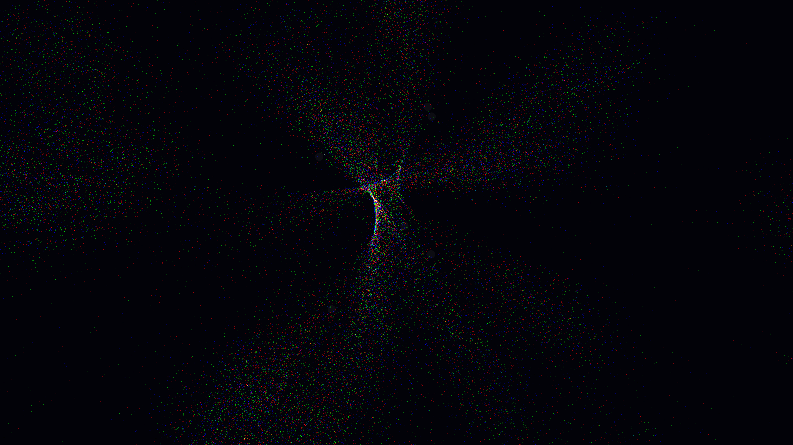

# hyperspectral_lens_cluster

## Metadata
- **Date**: 2026-05-07
- **Theme**: Gravitational lensing, galaxy cluster, dark matter, Einstein rings, chromatic aberration, beautiful night sky.
- **Technique**: 2D projection of a complex gravitational lens field. Background "galaxies" (60,000 particles) are distorted by a cluster of 6 massive objects using a vectorized deflection model. Implements "hyperspectral smearing" where different color channels are deflected by varying amounts to simulate relativistic chromatic aberration. Uses additive blending for vibrant, shimmering arcs and rings. 60fps high-bitrate MP4.
- **Logic Lab Reference**: None

## Concept
A mesmerizing window into the deep universe; distant, colorful galaxies are stretched and warped into elegant, shimmering arcs and glowing Einstein rings by an invisible, massive cluster in the foreground, creating a spectral tapestry of light against the silent obsidian void.

## Technical Details
- **Renderer**: P2D
- **Simulation**: particle.
- **Visuals**: additive blending, HSB spectral mapping, prismatic color, dark-field contrast.
- **Animation**: 10 seconds at 60fps
