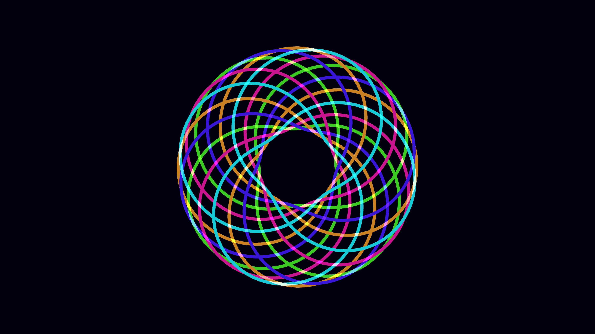

# hypnotic_neon_torus_knot_3d

## Details
- **Date**: 2026-06-07
- **Theme**: A hypnotic, infinite loop of glowing, neon-lit, 3D toroidal ribbons twisting into a mesmerizing knot.
- **Technique**: Parametric 3D formulas defining a Torus Knot. Ribbons drawn with thick strokes, glowing blending, and slow rotation.
- **Palette**: Deep indigo background, neon magenta, electric cyan, and glowing yellow.

## Media

