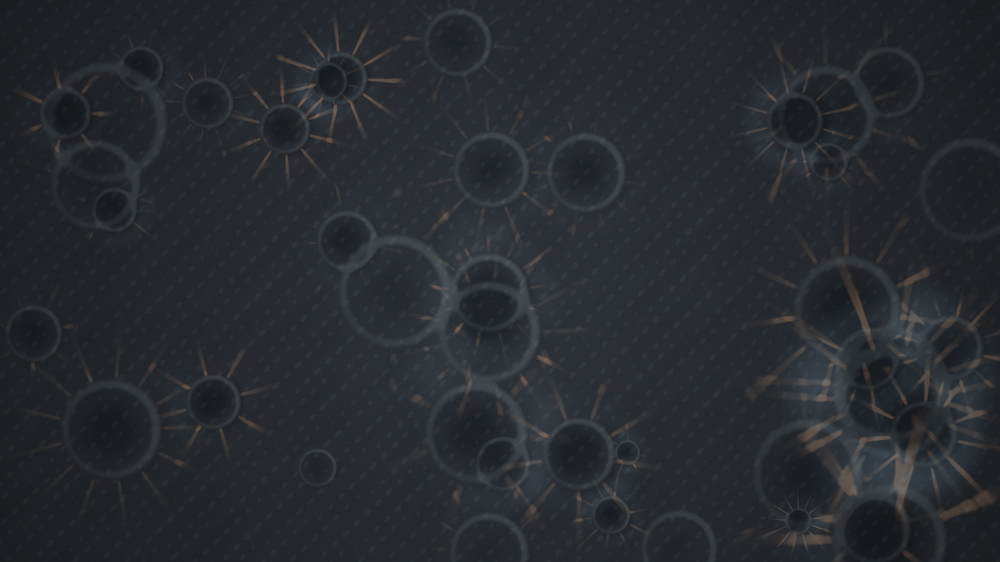

# impact_palimpest

## Metadata
- **Date**: 2026-05-03
- **Theme**: repeated collision, regolith memory, natural surface abstraction.
- **Technique**: Crater heightfield synthesis, asymmetric rim lighting, ballistic ejecta rays, slope-based relief shading.
- **Logic Lab Reference**: None

## Concept
A dark regolith-like surface is overwritten by overlapping impact bowls, muted copper ejecta rays, cold shadowed basins, and pale worn rims; the image reads as an abstract record of repeated collisions.

## Technical Details
- **Renderer**: P2D
- **Simulation**: Crater heightfield synthesis, asymmetric rim lighting, ballistic ejecta rays, slope-based relief shading.
- **Visuals**: bloom-like highlights, dark-field contrast.
- **Animation**: Still image
