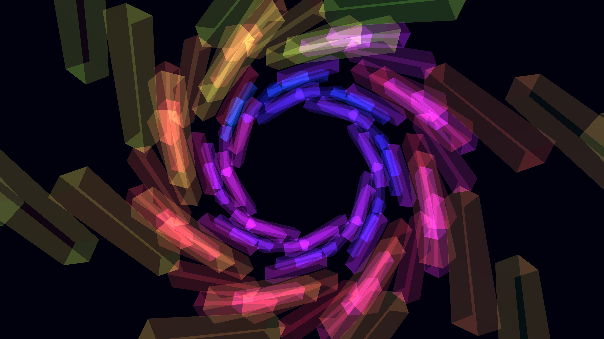

# infinite_neon_glass_labyrinth_3d

A slow, continuous flythrough of an infinite 3D labyrinth made of translucent frosted glass pillars illuminated by moving neon light sources, producing intense caustics and refractions.

## Technique

3D boxes drawn along a rotating, infinite Z-axis tunnel. Additive blending (`py5.blend_mode(py5.ADD)`) and disabled depth testing simulate translucent, glowing frosted glass. Colors shift dynamically using frame count and 3D positioning.
