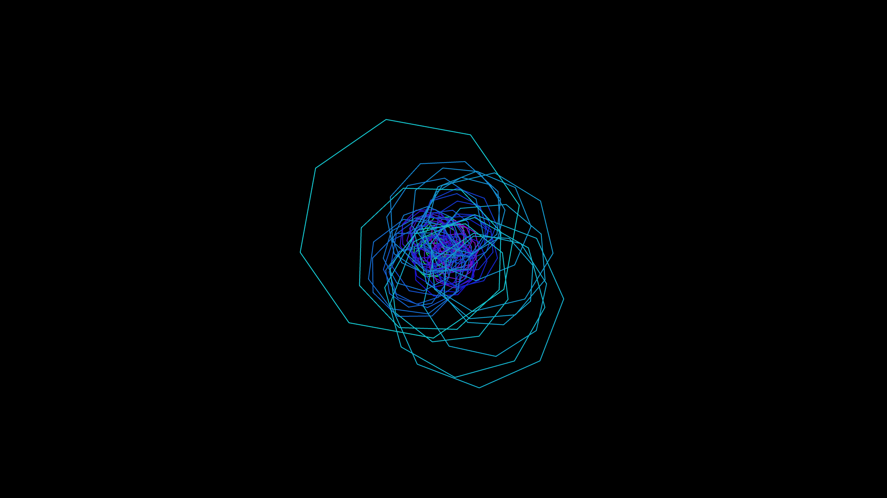

# infinite_polygon_hyperspace_tunnel

## Metadata
- **Date**: 2026-05-27
- **Theme**: - **Date**: 2026-05-27 - **Theme**: An infinite, hypnotic tunnel flight through a twisting corridor 
- **Technique**: Unknown
- **Logic Lab Reference**: 

## Concept
- **Date**: 2026-05-27
- **Theme**: An infinite, hypnotic tunnel flight through a twisting corridor of glowing wireframe polygons.
- **Technique**: A series of concentric polygons drawn along a 3D path. The path is warped by sine waves and Perlin noise. The polygons shift their Z-coordinates toward the camera and reset, creating an infinite loop effect.
- **Description**: An animated 3D wireframe hyperspace tunnel.

## Technical Details
- **Renderer**: Unknown
- **Simulation**: Unknown
- **Visuals**: Unknown
- **Animation**: Unknown
