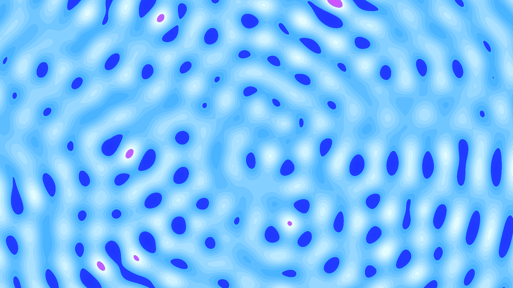

# interference_topography

## Metadata
- **Date**: 2026-05-04
- **Theme**: Wave mechanics, constructive interference, rhythmic precision, topological light.
- **Technique**: High-density vectorized wave interference (10 emitters), contour quantization (18 levels), Lissajous emitter path logic, Retina-aware pixel-buffer compositing.
- **Logic Lab Reference**: None

## Concept
A dense, vibrating field of sharp geometric contours that ripple outward from multiple moving centers; where the ripples meet, they form intense, glowing "nodes" of gold and cyan light that dance across a dark indigo void.

## Technical Details
- **Renderer**: P2D
- **Simulation**: High-density vectorized wave interference (10 emitters), contour quantization (18 levels), Lissajous emitter path logic, Retina-aware pixel-.
- **Visuals**: pixel-buffer rendering, bloom-like highlights, dark-field contrast.
- **Animation**: 12 seconds at 60fps
