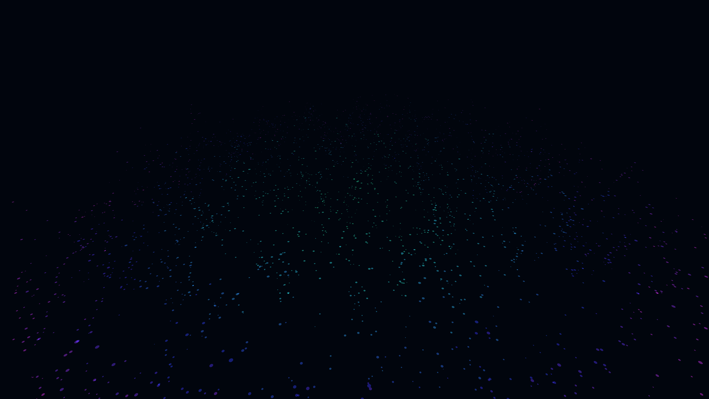

# iridescent_gravitational_galaxy_3d

## Metadata
- **Date**: 2026-06-07
- **Theme**: A swirling galaxy of iridescent particles that react to invisible gravitational attractors, forming 
- **Technique**: A particle system using 3000 tiny ellipses placed in a spiral arrangement. A 3D Perlin noise field determines their Z-axis displacement and dynamic scaling. Additive blending combined with smooth HSB hue rotation creates a mesmerizing, glowing galactic look.
- **Logic Lab Reference**: 

## Concept
A swirling galaxy of iridescent particles that react to invisible gravitational attractors, forming an organic, glowing cosmic structure in 3D space.

## Technical Details
- **Renderer**: Unknown
- **Simulation**: Unknown
- **Visuals**: Unknown
- **Animation**: Unknown
