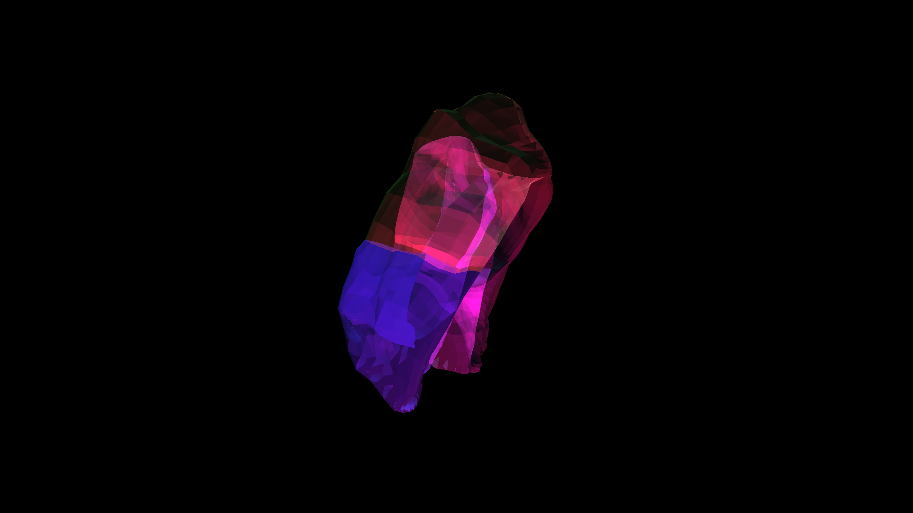

# iridescent_klein_bottle_refraction_3d

## Concept

An organic, pulsating membrane that folds into itself like a Klein bottle, shifting in iridescent hues of pearl, cyan, and pink.

## Execution

- **Technique**: 3D parametric figure-8 Klein bottle mesh with 3D simplex noise distortion acting as an organic breathing effect. Additive blending and lighting simulate iridescent refraction.
- **Format**: Animation (15s @ 60fps)

## Files

- `main.py` - Primary script
- `iridescent_klein_bottle_refraction_3d_p1.png` - Visual preview
- `iridescent_klein_bottle_refraction_3d.mp4` - Animation output (Not tracked in git)
