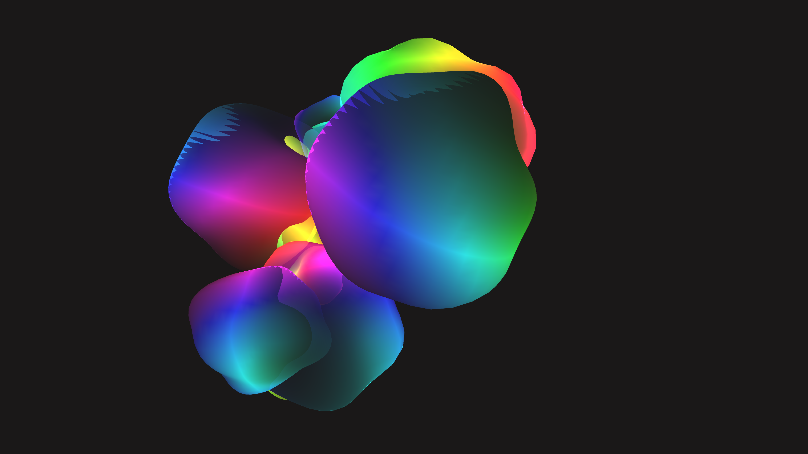

# iridescent_soap_bubble_cluster_3d

## Metadata
- **Date**: 2026-06-08
- **Theme**: - **Date**: 2026-06-08 - **Theme**: A slow-drifting cluster of weightless, intersecting soap bubbles
- **Technique**: Unknown
- **Logic Lab Reference**: 

## Concept
- **Date**: 2026-06-08
- **Theme**: A slow-drifting cluster of weightless, intersecting soap bubbles that wobble organically and refract a highly saturated, iridescent rainbow.
- **Technique**: Multiple intersecting 3D `QUAD_STRIP` spheres. To simulate the wobble, the radius of each vertex is modulated with 4D OpenSimplex noise. The color is mapped into HSB space using the simulated surface normal to create dynamic chromatic iridescence.
- **Description**: An animated 15s simulation of intersecting iridescent soap bubbles floating in a dark void.

## Technical Details
- **Renderer**: Unknown
- **Simulation**: Unknown
- **Visuals**: Unknown
- **Animation**: Contains animation details
