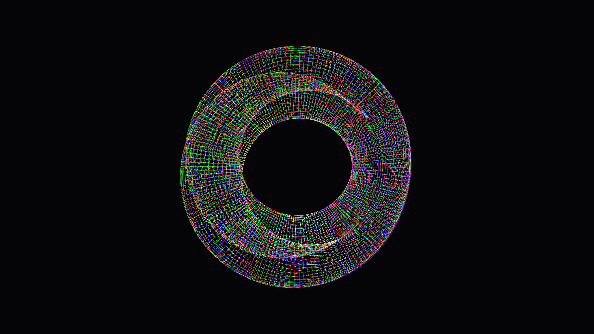

# iridescent_topological_klein_bottle_3d

## Metadata
- **Date**: 2026-06-08
- **Theme**: Generative Art
- **Technique**: Parametric 3D equations for a Klein bottle drawn with a dense QUAD_STRIP mesh. Multi-pass rendering with slight spatial/rotational offsets for R, G, B channels creates a chromatic aberration glass effect.
- **Logic Lab Reference**: 

## Concept
No concept description provided.

## Technical Details
- **Renderer**: Unknown
- **Simulation**: Unknown
- **Visuals**: Unknown
- **Animation**: [iridescent_topological_klein_bottle_3d_p1.png](iridescent_topological_klein_bottle_3d_p1.png)
