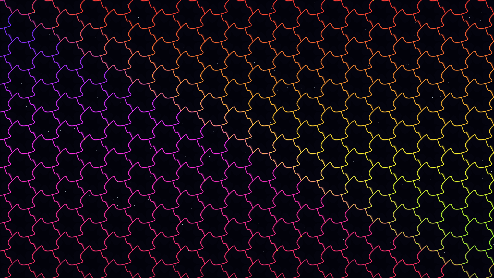

# isohedral_metropolis

## Metadata
- **Date**: 2026-05-04
- **Theme**: Non-Euclidean urbanism, interlocking systems, metabolic pulse, synthetic nature
- **Technique**: IH01 Isohedral tiling, dynamic Bezier deformation, persistence-buffer trail accumulation, high-density starfield rendering
- **Logic Lab Reference**: `tiling_patterns/ih01_deformation/ih01_deformation.py`

## Concept
A dense, glowing metropolis defined by complex interlocking "living blocks" that pulse and shift against a deep star-dusted night; luminous conduits in cyan and magenta trace the shifting boundaries, while golden data hubs flicker at the intersections of the metabolic grid.

## Technical Details
- **Renderer**: P2D
- **Simulation**: IH01 Isohedral tiling
- **Visuals**: dynamic Bezier deformation, persistence-buffer trail accumulation, high-density starfield rendering
- **Animation**: 10s @ 60fps (typical)
