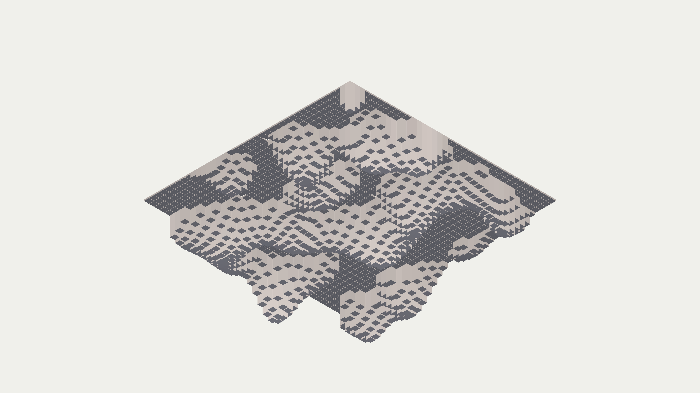

# isometric_brutalist_concrete_maze_3d

## Metadata
- **Date**: 2026-06-17
- **Theme**: An animated sequence of an endless brutalist concrete maze where walls slide vertically out of the g
- **Technique**: Orthographic 3D projection (`py5.ortho()`). A dense 3D grid of boxes representing walls. The height of each box is determined by a sweeping 2D Perlin noise field and sine waves. Harsh directional lighting is used to create strong minimalist shadows and concrete textures.
- **Logic Lab Reference**: 

## Concept
An animated sequence of an endless brutalist concrete maze where walls slide vertically out of the ground in a mesmerizing wave, creating shifting geometric shadows.

## Technical Details
- **Renderer**: Unknown
- **Simulation**: Unknown
- **Visuals**: Unknown
- **Animation**: Unknown
