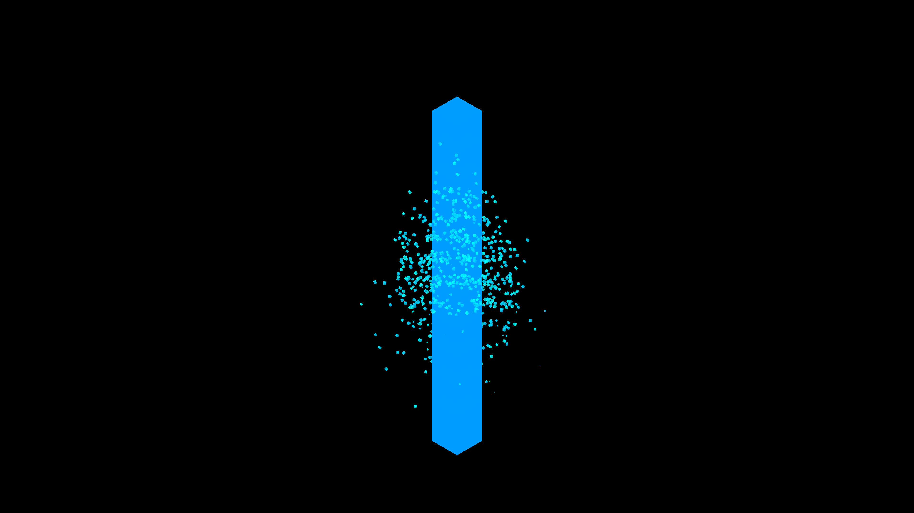

# isometric_cyber_waterfall

## Metadata
- **Date**: 2026-05-27
- **Theme**: - **Date**: 2026-05-27 - **Theme**: A mesmerizing, endless waterfall of digital cubes cascading down
- **Technique**: Unknown
- **Logic Lab Reference**: 

## Concept
- **Date**: 2026-05-27
- **Theme**: A mesmerizing, endless waterfall of digital cubes cascading down invisible isometric steps, representing the flow of raw data.
- **Technique**: 3D cubes are drawn using `py5.box` with an orthographic camera (`py5.ortho`) set to isometric angles. Cubes spawn at the top and fall under simulated gravity, bouncing off invisible stair-step colliders. Additive blending and emissive materials create a neon digital aesthetic.
- **Description**: A cascading isometric waterfall of cubes.

## Technical Details
- **Renderer**: Unknown
- **Simulation**: Unknown
- **Visuals**: Unknown
- **Animation**: Unknown
