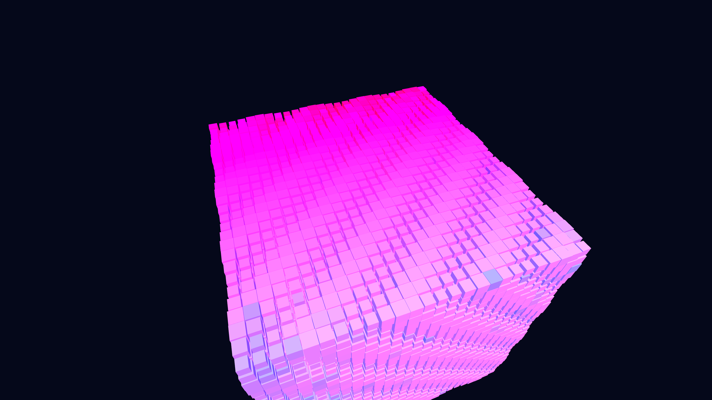

# isometric_data_coral_reef_growth_3d

An animated 15s sequence of a rigid, isometric 3D grid slowly overgrown by an organic, sprawling data coral reef, combining brutalist geometry with organic growth via a 3D cellular automaton.

## Details
- **Format**: Animation (15s @ 60fps)
- **Theme**: A rigid, isometric 3D grid slowly overgrown by an organic, sprawling data coral reef, combining brutalist geometry with organic growth.
- **Technique**: Cellular automaton in a 3D grid where blocks "grow" outward based on neighbor counts. The blocks are rendered in an isometric projection, with colors shifting from deep cyan to bright magenta as the coral structure ages.
- **Date**: 2026-06-12

## Preview

