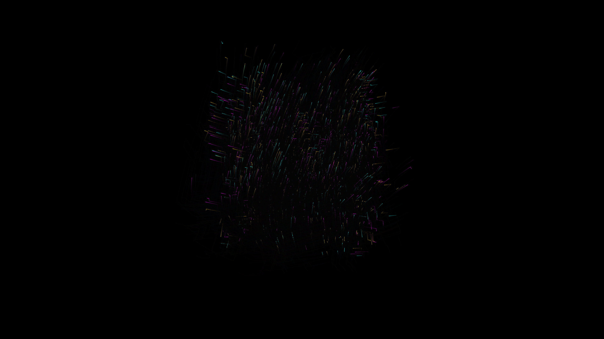

# isometric_magnetic_flow_lattice

## Metadata
- **Date**: 2026-05-25
- **Theme**: - **Date**: 2026-05-25 - **Theme**: A massive geometric lattice channeling invisible magnetic stream
- **Technique**: Unknown
- **Logic Lab Reference**: 

## Concept
- **Date**: 2026-05-25
- **Theme**: A massive geometric lattice channeling invisible magnetic streams in isometric projection.
- **Technique**: Isometric 3D particle simulation where particles are constrained to grid axes but swept along a magnetic vector field, leaving geometric, neon laser-like trails.
- **Description**: Thousands of glowing particles forge sharp, right-angled paths through space, building a dense, glowing cybernetic grid in a dark void.

## Technical Details
- **Renderer**: Unknown
- **Simulation**: Unknown
- **Visuals**: Unknown
- **Animation**: Unknown
