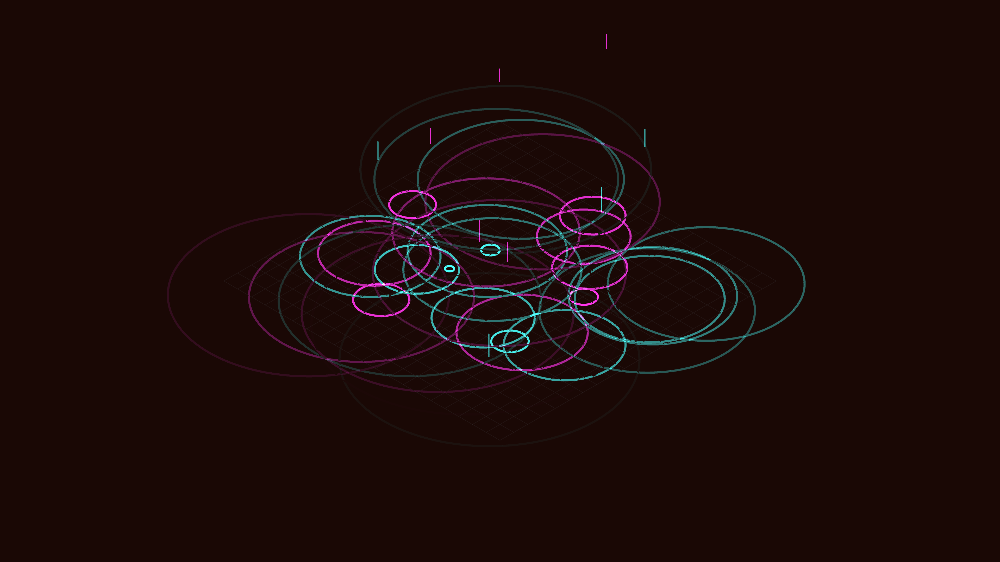

# isometric_neon_rain_ripples_3d

## Metadata
- **Date**: 2026-06-14
- **Theme**: An animated 15s sequence of neon magenta and cyan raindrops falling onto a metallic grid and creatin
- **Technique**: Orthographic 3D projection using `py5.ortho()`. A flat plane composed of a dense grid. Raindrops are particles falling from the sky. When they hit the grid, they spawn expanding circular ripples. The ripples intersect and create interference patterns, mapped to bright cyan and magenta colors against a dark background with additive blending.
- **Logic Lab Reference**: 

## Concept
An animated 15s sequence of neon magenta and cyan raindrops falling onto a metallic grid and creating glowing circular ripples.

## Technical Details
- **Renderer**: Unknown
- **Simulation**: Unknown
- **Visuals**: Unknown
- **Animation**: Unknown
