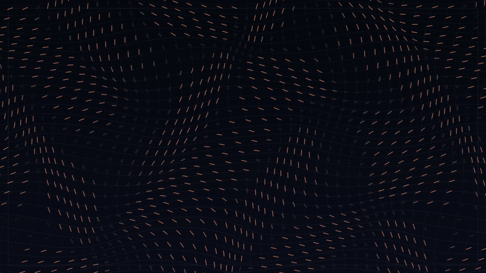

# jacobian_drift

## Metadata
- **Date**: 2026-05-03
- **Theme**: invisible pressure, coordinate weather, mathematical deformation.
- **Technique**: Nonlinear coordinate warp, finite-difference Jacobian analysis, warped coordinate families, tensor ellipse glyph rendering.
- **Logic Lab Reference**: None

## Concept
A dark indigo coordinate field bends under hidden Gaussian pressure centers; silver-blue warped traces and coral tensor ellipses reveal local stretch, compression, and rotation across the full canvas.

## Technical Details
- **Renderer**: P2D
- **Simulation**: Nonlinear coordinate warp, finite-difference Jacobian analysis, warped coordinate families, tensor ellipse glyph rendering.
- **Visuals**: layered py5 drawing.
- **Animation**: Still image
