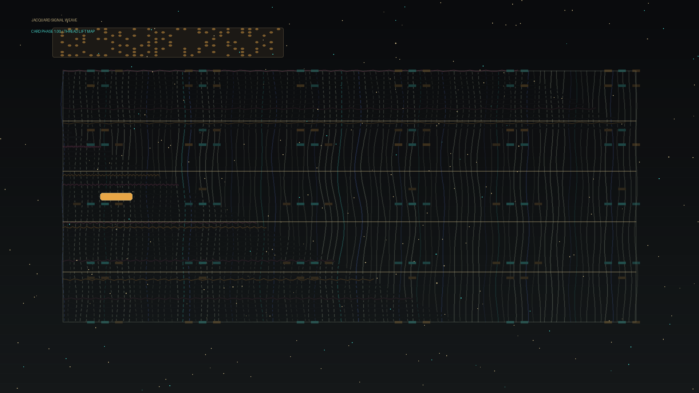

# jacquard_signal_weave

## Metadata
- **Date**: 2026-05-26
- **Theme**: Generative Art
- **Technique**: This 10-second 60fps animation renders a Jacquard-like loom with moving punched-card holes, lifted warp threads, partial weft passes, shuttle motion, and an emerging woven motif. The palette uses graphite, linen, cyan, mulberry, amber, and indigo.
- **Logic Lab Reference**: 

## Concept
No concept description provided.

## Technical Details
- **Renderer**: Unknown
- **Simulation**: Unknown
- **Visuals**: Unknown
- **Animation**: Contains animation details
