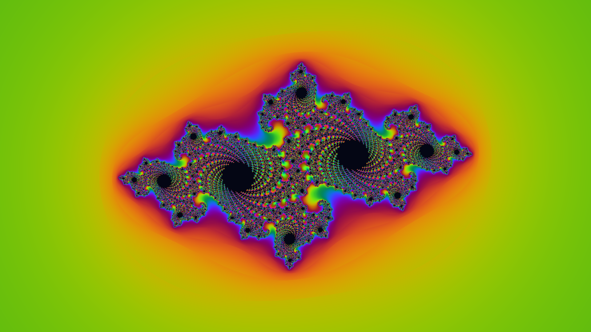

# Julia Set

A Julia set fractal rendered with smooth escape-time coloring. The constant c = −0.7269 + 0.1889i (Douady rabbit) produces intricate spiral dendrites at the boundary between bounded and unbounded orbits in the complex plane. Full-spectrum sine-wave palette cycling reveals iteration depth across the fractal's self-similar structure.
