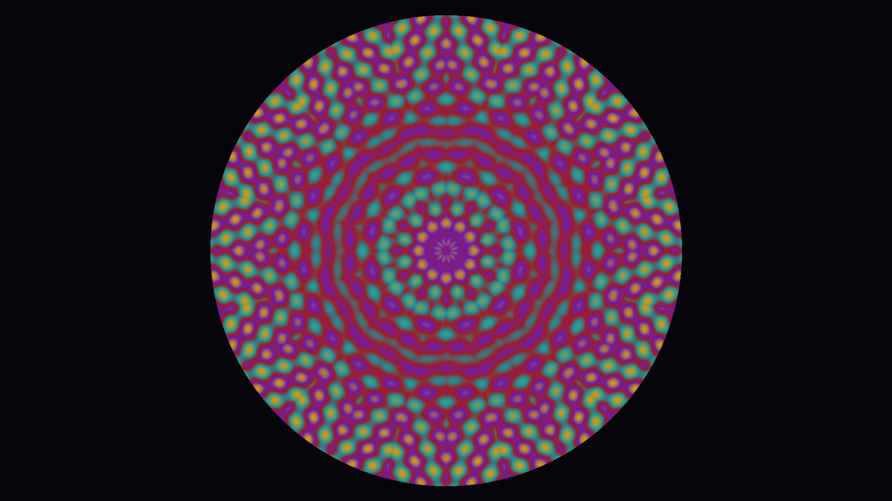

# kaleidoscope

## Metadata
- **Date**: 2026-04-26
- **Theme**: optics, symmetry, mandala, geometry, stained glass.
- **Technique**: polar coordinate folding into canonical sector, multi-frequency sine product pattern, cyclic 4-stop jewel-tone palette, circular mask.
- **Logic Lab Reference**: None

## Concept
12-fold kaleidoscope; a 15° wedge of interfering sine harmonics is reflected and rotated to fill a circle; jewel-tone cyclic palette produces concentric stained-glass rings.

## Technical Details
- **Renderer**: P2D
- **Simulation**: polar coordinate folding into canonical sector, multi-frequency sine product pattern, cyclic 4-stop jewel-tone palette, circular mask.
- **Visuals**: HSB spectral mapping, prismatic color, dark-field contrast.
- **Animation**: Still image
