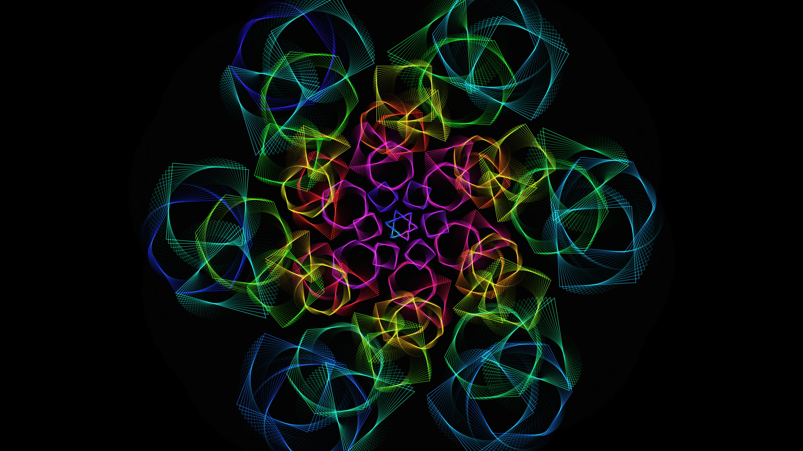

# kaleidoscopic_geometry_mandala

## Metadata
- **Date**: 2026-05-27
- **Theme**: - **Date**: 2026-05-27 - **Theme**: A mesmerizing, infinite kaleidoscope of overlapping, semi-transp
- **Technique**: Unknown
- **Logic Lab Reference**: 

## Concept
- **Date**: 2026-05-27
- **Theme**: A mesmerizing, infinite kaleidoscope of overlapping, semi-transparent neon geometric shapes (triangles, squares, hexagons).
- **Technique**: A nested loop of push/pop matrices that draw polygons with varying rotations and scales. The scale and rotation are modulated by sine waves and time. Additive blending is used to create bright intersections.
- **Description**: An animated kaleidoscopic geometry mandala.

## Technical Details
- **Renderer**: Unknown
- **Simulation**: Unknown
- **Visuals**: Unknown
- **Animation**: Unknown
