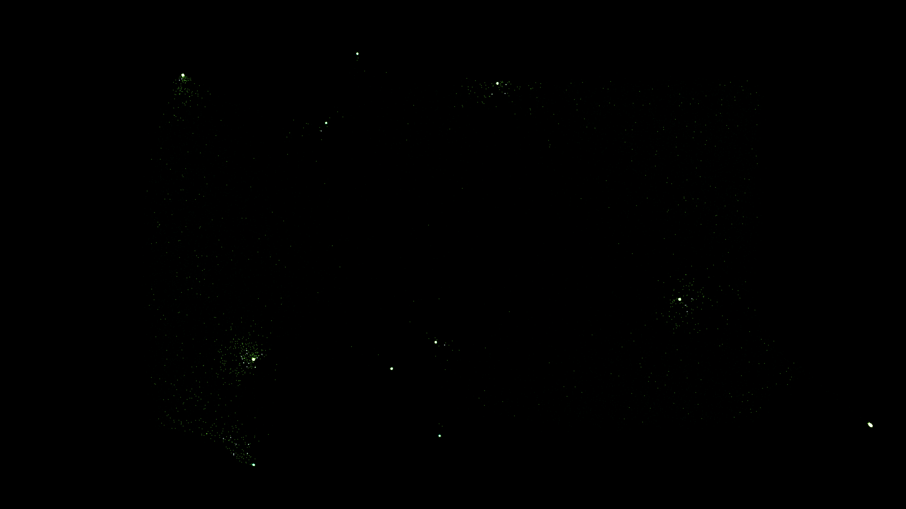

# kerr_effect_filamentation

## Metadata
- **Date**: 2026-05-11
- **Theme**: Non-linear optics, Kerr effect, self-focusing, laser filamentation, spatial solitons.
- **Technique**: 2D particle simulation of laser filamentation. Tracers are advected by the gradient of an intensity field governed by non-linear self-focusing dynamics. Features multi-pass additive rendering with a "Deep Emerald / Neon Lime / Prism White" palette. 20s 4K/60fps MP4.
- **Logic Lab Reference**: None

## Concept
A central beam of emerald light breaks into brilliant filaments, creating a high-energy crystalline structure through non-linear self-focusing.

## Technical Details
- **Renderer**: P2D
- **Simulation**: particle.
- **Visuals**: additive blending, HSB spectral mapping, prismatic color, dark-field contrast.
- **Animation**: 20 seconds at 60fps
