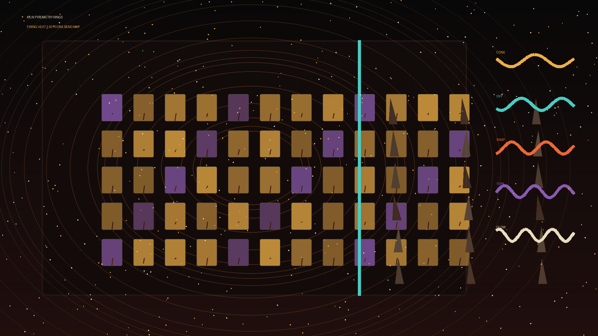

# kiln_pyrometry_rings

## Metadata
- **Date**: 2026-05-26
- **Theme**: Generative Art
- **Technique**: This 10-second 60fps animation renders a dark kiln chamber with pulsing pyrometry rings, witness tiles, melting glaze drips, pyrometric cones, ash motes, and side telemetry traces.
- **Logic Lab Reference**: 

## Concept
No concept description provided.

## Technical Details
- **Renderer**: Unknown
- **Simulation**: Unknown
- **Visuals**: Unknown
- **Animation**: Contains animation details
