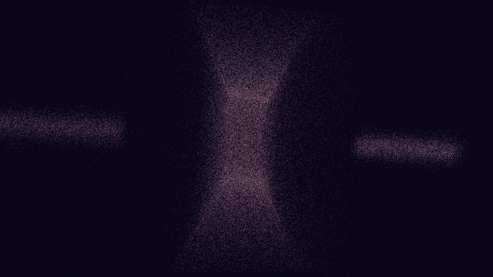

# kilonova_merger_ripple

## Metadata
- **Date**: 2026-05-07
- **Theme**: Neutron star merger, kilonova, nucleosynthesis, gravitational waves, beautiful night sky.
- **Technique**: 3D simulation of a binary neutron star system spiraling into a collision. Features a real-time background starfield ripple effect simulating space-time distortion. Post-collision, it triggers an asymmetric ejection of 300,000 particles (toroidal + polar jets) with a spectral shift from blue-white to rose gold and platinum. 60fps high-bitrate MP4.
- **Logic Lab Reference**: None

## Concept
A violent and beautiful celestial event; two tiny, blinding dots dance in a tightening spiral, warping the very stars behind them, before vanishing into a spectacular explosion of shimmering gold and platinum dust that fills the void.

## Technical Details
- **Renderer**: P3D
- **Simulation**: particle.
- **Visuals**: HSB spectral mapping, bloom-like highlights, prismatic color, dark-field contrast.
- **Animation**: 10 seconds at 60fps
